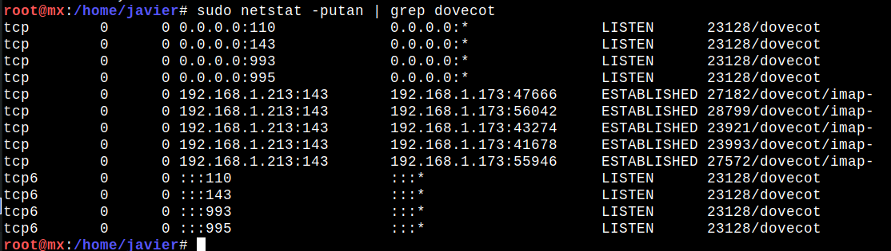

# Servidor Postfix

## Configuracion del postfix

Empezaremos instalando Postfix
~~~
sudo apt install postfix
~~~

~~~
sudo dpkg-reconfigure postfix
~~~

En esta marcaremos NO

Lo dejamos en blanco

51200000

**Aqui ya tenemos la configuracion del postfix**

## Archivo alises

Entramos en el archivo <code>/etc/alises</code> comentaremos la linea de postmaster y añadimos una linea poniendo
~~~
root: javier
~~~

## Mailname

El archivo de la siguiente ruta tiene que tener nuestro dominio
~~~
/etc/mailname
~~~

## Instalacion de dovecot

Ahora ejecutamos el siguiente comando que instalara el dovecot
~~~
sudo apt install dovecot-imapd dovecot-pop3d
~~~

## Configuracion de Dovecot

Para empezar vamos a hacer una copia de seguridad de este archivo: <code>/etc/dovecot/dovecot.conf</code>

Y ahora añadiremos estas tres lineas al archivo: <code>/etc/dovecot/dovecot.conf</code>
~~~
protocols = imap imaps pop3 pop3s
disable_plaintext_auth = no
mail_location = mbox:~/mail:INBOX=/var/mail/%u
~~~

Ahora reiniciaremos los servicios
~~~
sudo service postfix restart
~~~
~~~
sudo service dovecot restart
~~~

Para poder comprobar que tengamos los puertos en escucha del dovecot ejecutaremos el siguiente comando
~~~
sudo netstat -putan | grep dovecot
~~~

 
## Certificados

Ejecutaremos el siguiente comando para crear el certificado
~~~
sudo openssl req -x509 -nodes -days 365 -newkey rsa:2048 -keyout /etc/ssl/private/correo.key -out /etc/ssl/certs/correo.crt
~~~

Ahora vamos a cambiar los certificados del arcivo <code>/etc/postfix/main.cf</code>
**Hay que sustituir las lineas excepto la ultima que tenemos que añadirla**

~~~
# TLS parameters COBARDES
smtpd_tls_cert_file=/etc/ssl/certs/correo.crt
smtpd_tls_key_file=/etc/ssl/private/correo.key
smtpd_tls_security_level=may
~~~

Ahora reiniciaremos los servicios
~~~
sudo service postfix restart
~~~
~~~
sudo service dovecot restart
~~~

## Thunderbird

Ahora accederemos al correo desde el  thunderbird

Si hace falta instalarlo se hace con:
~~~
sudo apt install thunderbird
~~~

Ahora vamos a acceder al server desde el thunderbird

## Certificados

Ejecutaremos el siguiente comando para crear el certificado
~~~
sudo openssl req -x509 -nodes -days 365 -newkey rsa:2048 -keyout /etc/ssl/private/correo.key -out /etc/ssl/certs/correo.crt
~~~

Ahora vamos a cambiar los certificados del arcivo <code>/etc/postfix/main.cf</code>
**Hay que sustituir las lineas excepto la ultima que tenemos que añadirla**

~~~
# TLS parameters COBARDES
smtpd_tls_cert_file=/etc/ssl/certs/correo.crt
smtpd_tls_key_file=/etc/ssl/private/correo.key
smtpd_tls_security_level=may
smptd_use_tls=yes 
~~~

Ahora reiniciaremos los servicios
~~~
sudo service postfix restart
~~~
~~~
sudo service dovecot restart
~~~

