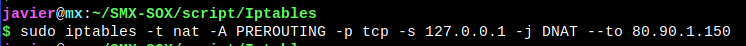
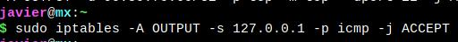

# Iptables

## EJERCICIO 1

Empezamos listando todas las reglas o cadenas introducidas al cortafuegos
~~~
sudo iptables -S
~~~

~~~
sudo iptables --table nat -A PREROUTING -i eth0 -p tcp --dport 80 -j REDIRECT --to-port 3200
~~~

~~~
sudo iptables --table nat -A PREROUTING -i eth0 -p tcp --dport 443 -j REDIRECT --to-port 3200
~~~

~~~
sudo iptables --table nat -A PREROUTING -i eth0 -p tcp --dport 3200 -j REDIRECT --to-port 3200
~~~

## EJERCICIO 2

Borramos las reglas introducidas

~~~
sudo iptables -F
~~~

## EJERCICIO 3

Añadimos una regla para quitar todos los paquetes de salida

~~~
sudo iptables -P OUTPUT DROP
~~~

Aqui vemos que no tenemos internet 

## EJERCICIO 4

Eliminamos la regla anterior
~~~
sudo iptables -S
~~~

~~~
sudo iptables -P OUTPUT ACCEPT
~~~

~~~
sudo iptables -S
~~~

Comprobamos que no tenemos acceso a internet

## EJERCICIO 5

Añadimos una regla para no dejar pasar ningun paquete de entrada 
~~~
sudo iptables -P INPUT DROP
~~~

~~~
sudo iptables -S
~~~

No tenemos acceso a internet 

## EJERCICIO 6

Borramos la regla anteriormente introducida
~~~
sudo iptables -P INPUT ACCEPT
~~~

~~~
sudo iptables -S
~~~

## EJERCICIO 7

Añadimos una regla para dejar pasar todos los paquetes de salida
~~~
sudo iptables -P OUTPUT ACCEPT
~~~

~~~
sudo iptables -S
~~~

## EJERCICIO 8

Tenemos instalado un servidor web y queremos permitir el acceso al exterior 
~~~
sudo iptables -A INPUT -p tcp --dport 80 -j ACCEPT
~~~

~~~
sudo iptables -A INPUT -p tcp --dport 443 -j ACCEPT
~~~

~~~
sudo iptables -S
~~~

## EJERCICIO 9

Tenemos un servidor FTP y queremos permitir el acceso FTP desde el exterior
~~~
sudo iptables -A INPUT -p tcp -j ACCEPT
~~~

~~~
sudo iptables -S
~~~

## EJERCICIO 10

Si quieres denegar el acceso por debajo del puerto 1024 
~~~
sudo iptables -A INPUT -p tcp --dport :1023 -j DROP
~~~

~~~
sudo iptables -A INPUT -p udp --dport :1023 -j DROP
~~~

~~~
sudo iptables -S
~~~

## EJERCICIO 11

Rechazamos todos los paquetes que vengan de la direccion 80.100.30.27(mirar bien )
~~~
sudo iptables -A INPUT -s 127.0.0.1 -d 80.100.30.27 -p tcp -j DROP
~~~

~~~
sudo iptables -A INPUT -s 127.0.0.1 -d 80.100.30.27 -p udp -j DROP
~~~

~~~
sudo iptables -S
~~~

## EJERCICIO 12

Borra todas las reglas introducidas y añade una para que no se pueda hacer a nuetsro equipo
~~~
sudo iptables -F
~~~

~~~
sudo iptables -A INPUT -s 127.0.0.1 -p icmp -j DROP
~~~

~~~
sudo iptables -S
~~~

## EJERCICIO 13

Añade una regla para dejar pasar todos los paquetes que procedan de 127.0.0.1 y vayan dirigidos al equipo 80.90.1.150
~~~
sudo iptables -t nat -A PREROUTING -p tcp -s 127.0.0.1 -j DNAT --to 80.90.1.150
~~~

~~~
sudo iptables -t nat -A PREROUTING -p udp -s 127.0.0.1 -j DNAT --to 80.90.1.150
~~~

## EJERCICIO 14

No queremos permitir que el equipo 80.90.100.110 se pueda conectar a nuestro servidor web
~~~
sudo iptables -A INPUT -p tcp --dport 80 -d 80.90.100.110 -j DROP
~~~

~~~
sudo iptables -S
~~~

## EJERCICIO 15

Añade una regla para permitir el acceso vía ssh (puerto 22) al equipo con ip 90.80.70.60.

~~~
sudo iptables -A OUTPUT -p tcp --dport 22 -d 90.80.70.60 -j ACCEPT
~~~

~~~
sudo iptables -S
~~~

## EJERCICIO 16

Añade una regla cuya función sea hacer ping desde nuestra propia máquina (protocolo icmp).

~~~
sudo iptables -A OUTPUT -s 127.0.0.1 -p icmp -j ACCEPT
~~~

~~~
sudo iptables -S
~~~

## EJERCICIO 17

Añade una regla para que el ordenador que tienes situado a tu derecha no obtenga respuesta al hacer ping.

~~~
sudo iptables -A OUTPUT -s 127.0.0.1  -d 192.168.4.105 -p icmp -j DROP
~~~

~~~
sudo iptables -S
~~~

## EJERCICIO 18

Añade una regla para impedir conectarse mediante FTP al ordenador con IP 192.168.1.15.

~~~
sudo iptables -A INPUT -p tcp -s 192.168.1.15 --dport 21 -j DROP
~~~

~~~
sudo iptables -S
~~~

