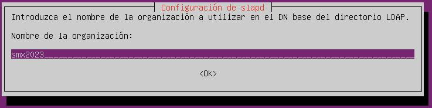

# LDAP
 
## OpenLDAP

1. Empezaremos instalando el paquete **slpad**:
~~~
    sudo apt install slapd
~~~

2. Instalaremos **MySQL**: 
~~~
    sudo apt install mysql-server
~~~

3. Despues instalamos el paquete **phpldadmin**:
~~~
    sudo apt install phpldadmin 
~~~

4. Cuando ya tengamos hechos los pasos anteriores procederemos a entrar desde otra maquina lo siguiente:
~~~
    http://HERE-MY-IP/phpldapadmin/
~~~

Pero al hacerlo en **jammy** tendremos unos cuantos errores que tendremos que arreglar a continuacion

5. Aqui tenemos una persona que lo a conseguido arreglar. Lo podemos descargar con el siguiente comando:
~~~
    wget https://github.com/leenooks/phpLDAPadmin/archive/refs/tags/1.2.6.4.zip
~~~

6. Al ejecutar el comando anterior nos descargara el archivo **1.2.6.4.zip**. Antes haremos una copia de seguiridad para no perder nada. Y lo descomprimimos en la carperta: 
<code>/etc/phpldamin/</code>

7. Ahora volvemos a entrar y ya no deberiamos tener errores.

## Reconfigurando slapd

Ahora vamos a reconfigurarlo que pondremos el siguiente comando
~~~
    sudo dpkg-reconfigure slapd
~~~
Ahora vamos a seguir las fotos siguientes:

Aqui le daremos a **NO**

Aqui crearemos el dominio **ubuntusrv.smx2023.net** que lo que tendremos que escrivir es: <code>dc=ubuntusrv,dc=smx2023,dc=net<code>

Aqui tenemos que añadir el nombre

Aqui le daremos que **NO**

Aqui le daremos que **YES**

## Configuracion del phpLDAPadmin

Ahora vamos a configurar el **phpLDAPadmin**

Para acceder al servidor debemos poner  lo siguiente <code>cn=admin,dc=ubuntusrv,dc=smx2023,dc=net</code> y pondremos la contraseña que hemos especificado anteriormente

A continuacion crearemos los objetos necesarios

## Crear objetos

Como vemos en la parte de la izquierda tenemos un sitio que pone: **Crear un objeto hijo**

Tenemos que seguir esta estructura que nos has indicado:
~~~
dc=ubuntusrvXX,dc=smx2023,dc=net
    cn=admin
    cn=goblins
       cn=goblin01
ou=tropas
~~~

Despues de hacer esa estructura nos queda de esta manera

## INSTALAR **LDAP-UTILS**

Nos instalamos con el siguiente comando el paquete **LDAP-UTILS** 
<code>sudo apt install ldap-utils</code>

Ahora para conectarnos con el server ponemos en la terminal el comando siguiente: 
<code>ldapsearch -x -b dc=ubuntusrv,dc=smx2023,dc=net -H ldap://YOUR-IP</code>

Si lo hemos puesto todo correctamente nos saldria lo siguiente

Y ya habriamos terminado todo correctamente
