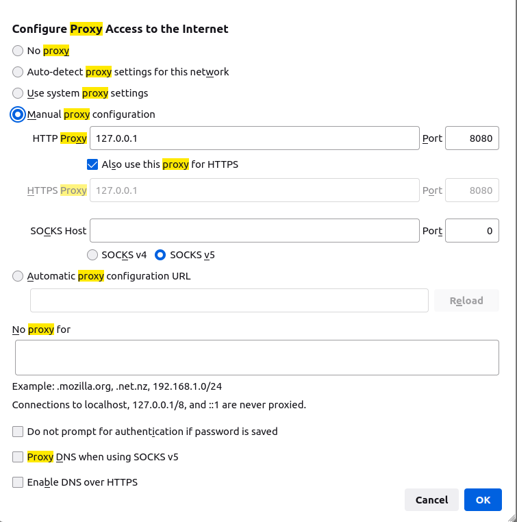
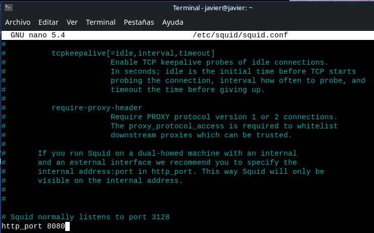
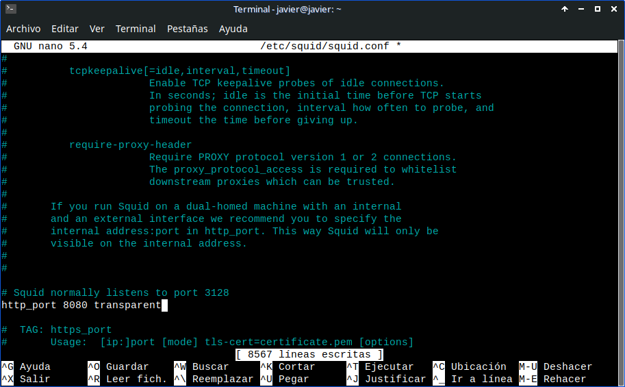

# SQUID

## Comienzos

Empezaremos actualiazidando la maquina para tener todo actualizado
~~~
sudo apt update && sudo apt full-upgrade --yes
~~~

A continuacion instalaremos <code>SQUID</code>
~~~
sudo apt install squid
~~~

Antes de todo añaderemos el squid a nuestro navegador 
Lo que haremos es ir a Ajustes despues iremos a el buscador que tenemos y escribiremos proxy y le daremos a configurar proxy y lo dejaremos tal cual lo tenemos en la siguiente imagen

Ahora ya vamos a centrarnos en el squid 
Tendremos el archivo de LOGS que es donde podremos ver cualquier cosa que pase en la siguiente ruta
~~~
sudo cat /var/log/squid/access.log
~~~

Y el archivo de configuracion que es el que tocaremos mas adelante lo tenemos en la siguiente ruta:
~~~
sudo nano /etc/squid/squid.conf 
~~~

Ahora para ya meternos en configuracion haremos un .bak por si acaso rompemos cualquier cosa poder volver atras tambien lo tendremos [aqui](./squid.conf.bak)
~~~
sudo cp /etc/squid/squid.conf /etc/squid/squid.conf.bak
~~~

El <code>Squid</code> escucha por defecto por el puerto **3128** pero nosotros vamos a cambiarlo a por ejemplo el **8080** y lo haremos en la siguiente directiva que se encuentra en la linea **2016** y la debemos buscar en el fichero <code>/etc/squid/squid.conf</code>
Debemos de poner esto
~~~
http_port 8080
~~~
Y nos quedaria asi 

Ahora para que nuestro euipo proxy reenvíe paquetes que no son nuestros es necesario que enrute esos paquetes para ello vamos a ejecutar lo siguiente
~~~
sudo sysctl -w net.ipv4.ip_forward=1
~~~

Vamos a rediguir todo lo que pase por la tarjeta de red que tenga como destino el puerto 80 de las paginas web y las redirigueremos a el puerto del squid (en nuestro caso el 8080)

Lo haremos añadiendolo al fichero <code>/etc/rc.local</code> que por defecto no viene creado y añadiremos estas 3 lineas
~~~
/sbin/iptables -P FORWARD ACCEPT

/sbin/iptables --table nat -A PREROUTING -i eth0 -p tcp --dport 80 -j REDIRECT --to-port 8080

exit 0
~~~
DONDE PONE eth0 ES VUESTRA INTERFAZ DE RED SE PUEDE MIRAR CON <code>ip a</code>

Para poder ejecutar lo anterior sin necesidad de reiniciar podriamos ejecutar el siguiente comando
~~~
sudo iptables -P FORWARD ACCEPT
~~~

~~~
sudo iptables --table nat -A PREROUTING -i eth0 -p tcp --dport 80 -j REDIRECT --to-port 8080
~~~

## BLACKLIST

Son las listas de las paginas o cualquier cosa que queremos denegar el acceso 

Vamos a añadir las **ACLs** y las tendremos que poner en la arte del documento que queramos 
Lo añadiremos en el archivo:
~~~
sudo nano /etc/squid/squid.conf 
~~~
Y añaderemos estas lineas 

~~~
acl permitir_red1 src 192.168.5.0/23
acl prohibir_palabras url_regex "/etc/squid/prohibir_palabras"
acl prohibir_webs dstdomain "/etc/squid/prohibir_webs"
~~~

y añaderemos estas justo debajo 
~~~
http_access deny prohibir_webs
http_access deny prohibir_palabras
http_access allow permitir_red1
~~~
Y despues debemos reinicial el servicio
~~~
sudo service squid restart
~~~

## WhiteList

Son las listas que solo permiten el acceso a lo que este en su lista
Añadiremos las paginas que si queramos permitir que vayamos
Lo añadiremos en el archivo:
~~~
sudo nano /etc/squid/squid.conf 
~~~

Y añadiremos esto en el fichero:
~~~
acl permitir_red1 src 192.168.1.0/24
acl permitir_webs dstdomain "/etc/squid/permitir_webs"
~~~

Y ahora despues añademos estas abajo:
~~~
http_access allow permitir_webs
http_access deny all
~~~
Y despues debemos reinicial el servicio
~~~
sudo service squid restart
~~~

## Horario en las reglas

Ahora vamos a filtrar por horario

Por ejemplo lo que haremos es activar la **BlackList** solo durante la mañana y entre los dias entre semana
Iremos al fichero 
~~~
sudo nano /etc/squid/squid.conf 
~~~
Y lo haremos de la siguiente manera añadiendo las siguientes lineas
~~~
acl horario time M T W T F 9:00-14:00
~~~

Y debajo probaremos esto
~~~
http_acces deny prohibir_webs horario
http_acces deny prohibir_palabras horario
http_acces allow permitir_red
http_acces deny all
~~~

Y despues debemos reinicial el servicio
~~~
sudo service squid restart
~~~

## Libertad total a un equipo concreto

Si queremos que una que <code>SQUID</code> no filtre el trafico del equipo que vamos a poner la primera para que no interfiera con las demas prohibiciones
~~~
acl equipo src 192.168.1.33
~~~
**LA IP ES UN EJEMPLO**

Y despues añadimos la siguiente linea
~~~
http_access allow equipo
~~~

<code></code>

Ahora vamos a hacer que el <code>Squid</code> sea transparante que bastara con en la misma linea añadir lo siguiente:
~~~
http_port 8080 transparent
~~~
Y nos quedaria asi 

